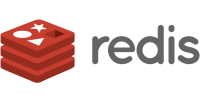

# Agenda

* Build up from the past to the present
* Discuss terms and technologies
* Glimpse at more details and the future
* Provide inspiration to learn more

-horizontal
## In the beginning,

there were no databases.

* As programmer you write some data to files
* Write some more by appending to the same file
* Read it back in and process as needed
* All custom code

> Obviously that was painful.

-vertical
## Desktop databases followed

* All data in a file on a local workstation
* Applications like dBase, FoxPro, Paradox, MS Access
* Often include a generic user interface
* Offer forms, reports, and more powerful features
* Allow custom programming

> Usage grew beyond local workstation.

-vertical
## Database servers arrive

* *Relational database management system (RDBMS)*
* Separate server for databases
* Manages storage and supports querying the data
* Allows multi-user support
* Scales for more data with bigger servers
* Provides backend for applications, especially web applications

-vertical
## Database servers succeed

* Separation of database and application server
* Enables vertical scaling, so more power with bigger server
* Often many databases per server
* Quite common the biggest server of a company

> And all was good for quite a long time.

-vertical
## Lots of well known examples

<div style="background-color: white">


</div>

> They form the backend for common stacks like LAMP and lots of commercial applications.

-notes

* Explain LAMP standing for Linux Apache MySQl Perl/PHP
* Lots of commercial ERP applications on Oracle, and so on..

-vertical
## Relational data model concepts

As used in RDBMS, from large to small:

* Database server
* Database
* Schema
* Table
* Columns
* Rows
* Data types

-notes

Potentially explain by talking about spreadsheet program.

-vertical
## SQL

* Structured Query Language (SQL)
* [Domain-specific language for data management](https://en.wikipedia.org/wiki/SQL)
* Specifically for relational data model
* Declarative language, not procedural
* Emerged early on, first standardized in 1986 with ISO/ANSI
* Very large standard that continuously improves
* Lots of dialects

-vertical
## Trivial SQL example

```sql
SELECT
  firstname || ' ' || lastname AS Name,
  dob AS Birthdate,
  date_diff('year', dob, current_date) AS Age
FROM person;
```

Note that the query does not detail how the data is retrieved,
just what data to get.

-vertical
## Popularity

* RDBMS take off
* SQL becomes the secondary programming language everyone knows
* RDBMS and SQL are used everywhere
* Every application is backed by some database
* Separate database server takes care of all details

-vertical
## More databases

* Companies end up with lots of databases
* Scale becomes tricky, or at least very expensive
* Distributed data means knowledge is lost

> Let's solve the problem of too many databases with one more database...

-vertical
## Data warehouse

* Another database specifically for analytics
* Complex processes to add data
* [Extract, transform, load (ETL)](https://en.wikipedia.org/wiki/Extract,_transform,_load)
* Precomputed aggregations and all sorts of complexities
* Very valuable and expensive for companies

-vertical
## Two sides of the coin

Main focus on data in or data out:

* Online transactional processing (OLTP)
    * Create the data
    * Typically by some application or processing
* Online analytical processing (OLAP)
    * Understand the data
    * Dashboards, reports, ad-hoc usage and research

-vertical
## Theories and pains

* Scale and performance
* [Atomicity, consistency, isolation, and durability ACID](https://en.wikipedia.org/wiki/ACID)
    * Many systems require all four
    * Especially for write operations
* [Consistency, Availability, Partition tolerance CAP theorem](https://en.wikipedia.org/wiki/CAP_theorem)
    * Critical to understand for distributed systems
    * You can never have all three at the same time
* SQL
    * Not everyone likes it
    * Many dialects and extensions

-vertical
## Alternatives emerge

Lots of different approaches:

* NoSQL databases
* Document database
* Graph databases
* Key-value stores
* Time series databases

> Promised to solve some or all issues.

-vertical
## Examples

<div style="background-color: white">



</div>

and many others.

-vertical
## Are they alternatives?

* Support specific use cases only
* For example, search or logs
* Data access via custom APIs
* SQL-like languages
* Scaling and performance is hard

> Often just a trade to different problems, or an additional solution.

-horizontal
## Continued growth

* Demand for managing more and more data
* Grew faster than capability of databases
* Especially hardware of single servers
* Megabytes and gigabytes used to be large values
* Today terabytes, petabytes, exabytes, and more are queried

-notes

* large databases from then now fit on your mobile phone
* all relative
* 640K memory on computer, CD,DVD,BD, USB sticks, mobile phones

-vertical
## Big Data and Hadoop

Distributed systems emerge to tackle the data:

* Many servers with files storing data
* [Apache Hadoop](https://en.wikipedia.org/wiki/Apache_Hadoop) ecosystem
* Hadoop Distributed File System (HDFS)
* MapReduce approach out of Google
* Scala as programming language
* [Big Data](https://en.wikipedia.org/wiki/Big_data) used as common term

> Ground breaking difference, but painful.

-vertical
## Data lake

* Many standard servers with storage
* Horizontal growth "Just get more servers"
* Separate storage at rest brings cost savings
* Terms *data lake* is used.

> Common to just dump all data into the lake, and worry about access and
> querying later.

-vertical
## Going backwards and forwards

* HDFS and MapReduce is compute and storage distributed together.
* Hive brings Hive QL to users, similar to SQL
* File storage moves to the cloud -> object storage

-vertical
## Object storage

Move to the cloud creates *separation of compute and storage*.

Cloud providers offer object storage as service:

* Amazon S3 and compatible systems
* Azure Storage
* Google Cloud Storage
* Many more

-vertical
## File system aspects

New file formats become prevalent:

* Typically open source
* Columnar file formats
    * [Apache ORC](https://orc.apache.org) and [Apache Parquet](https://parquet.apache.org)
* Row oriented
    * [Apache Avro](https://avro.apache.org)
    * CSV
    * JSON
* Partitioning and bucketing to help separate files and access

> Files and setups bring very different performance characteristics.

-vertical
## Metastores

* Files contain data
* Metastores contain metadata
* Information about schemas, tables, columns, data types, ...
* And mapping to files on object storage
* Hive metastore service (HMS), Amazon Glue, other "catalogs"

-notes

* also talk about how files can also contain metadata and different table formats have different reliance on metastores
* others Databricks Unity catalog, Iceberg REST and JDBC, Nessie

-horizontal
## Better big data

* Big Data ecosystem was very successful
    * Massive scale
    * Great performance improvements
    * Huge cost savings
* Uncovered many problems
    * Not flexible enough,
    * Not fast enough for OLAP
    * Not ACID compliant - bad for OLTP
    * Very complex
    * Hard to work with

-vertical
## Emergence of query engines

Separate compute layer:

* Dedicated to query for object storage data
* And other data sources
* Replaces Hive and MapReduce
* Supports object storage natively
* Many servers

Successful examples are [Apache Spark](https://spark.apache.org) and [Trino](https://trino.io)

-notes
* Trino formerly known as Presto

-vertical
## Table formats

Hive needed to be improved:

* Apache Iceberg out of Netflix, now Tabluar
* Delta Lake out of Apache Spark and Databricks, now in Linux Foundation
* Apache Hudi, out of Uber, now OneHouse

<div style="background-color: white">


</div>

-vertical
## Data lakehouse

* Object storage cluster with modern table format
* Query engine cluster
* Combines advantages of warehouse and lake

-vertical
## More innovation spreads

* Various metadata stores
* Support for open table formats everywhere
* Interoperability like Apache XTable, formerly OneTable

-vertical
## So where are we at

* Many storage servers
* Many compute servers
* Massively parallel processing

But still, data is everywhere, including in many silos.

-vertical
## Trino to the rescue

* Started as Presto at Facebook in 2012
* Now very powerful, mature query engine
* Rich [SQL](https://trino.io/docs/current/language.html), close to ISO/ANSI standard
* Many different [clients](https://trino.io/ecosystem/#clients)
* Large variety of [data sources](https://trino.io/ecosystem/#data-sources)
* Work with RDBMS, warehouse, lake, lakehouse, and more systems

-horizontal
## But wait, there is more

* Data keeps growing
* Data types and content
* Use cases get more complex
* Users demand more

-vertical
## Python

* Rich ecosystem of data tooling
* Emerged as default choice
* Different use cases from SQL
* Best to combine both

> Python is a massive separate and overlapping ecosystem for big data.

-vertical
## Dynamic aspects of data

* Streaming and ingestion systems
* Change Data Capture CDC
* ETL changes to ELT
* In-memory systems become critical for extreme performance
* Cold storage becomes critical for long term

-vertical
## The elephant in the room

Emergence of generative AI

* Changes everything again
* Models all the way to Large Language Models LLMs
* Vector databases and embeddings
* Richer data types like audio, speech, images, video, 3D data, ...
* Very different workloads, deployments, and processes
* Many servers, CPUs, and GPUs

-vertical
## Convergence

* Existing systems have a *lot* of valuable data
* New AI systems need to access that data too
* Overall everything raises to the next level of complexity

**AI lakehouse platforms** are emerging everywhere.

-vertical
## Questions?


