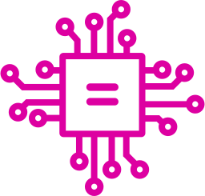
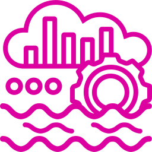

## Trino icons

Trino also has a useful icon library so you don't need to use boxes for your diagram anymore:

  <!-- .element width="70vw" style="float: none;" title="Authenticated non-object storage" -->
  <!-- .element width="70vw" style="float: none;" title="Authenticated object storage" -->
  <!-- .element width="70vw" style="float: none;" title="Authenticated session" -->
  <!-- .element width="70vw" style="float: none;" title="Authorized client" -->
  <!-- .element width="70vw" style="float: none;" title="Browser chart" -->
  <!-- .element width="70vw" style="float: none;" title="Catalog" -->
  <!-- .element width="70vw" style="float: none;" title="CLI" -->
  <!-- .element width="70vw" style="float: none;" title="Cloud Provider" -->
  <!-- .element width="70vw" style="float: none;" title="Cluster" -->
  <!-- .element width="70vw" style="float: none;" title="Connector" -->
  <!-- .element width="70vw" style="float: none;" title="Coordinator" -->
  <!-- .element width="70vw" style="float: none;" title="CPU" -->

  <!-- .element width="70vw" style="float: none;" title="Data entity" -->
  <!-- .element width="70vw" style="float: none;" title="Data lake" -->
  <!-- .element width="70vw" style="float: none;" title="Data lakehouse" -->
  <!-- .element width="70vw" style="float: none;" title="Data warehouse" -->
  <!-- .element width="70vw" style="float: none;" title="Desktop chart" -->
  <!-- .element width="70vw" style="float: none;" title="Generic service" -->
  <!-- .element width="70vw" style="float: none;" title="Group" -->
  <!-- .element width="70vw" style="float: none;" title="Memory" -->
  <!-- .element width="70vw" style="float: none;" title="Non-object storage" -->
  <!-- .element width="70vw" style="float: none;" title="Object storage" -->
  <!-- .element width="70vw" style="float: none;" title="Private cloud" -->
  <!-- .element width="70vw" style="float: none;" title="Privilege" -->

  <!-- .element width="70vw" style="float: none;" title="RBAC Provider" -->
  <!-- .element width="70vw" style="float: none;" title="Role" -->
  <!-- .element width="70vw" style="float: none;" title="Shared secret" -->
  <!-- .element width="70vw" style="float: none;" title="User" -->
  <!-- .element width="70vw" style="float: none;" title="Worker" -->

-vertical

## Cluster component icons

  <!-- .element width="70vw" style="float: none;" title="Cluster" -->
  <!-- .element width="70vw" style="float: none;" title="Coordinator" -->
  <!-- .element width="70vw" style="float: none;" title="Worker" -->
  <!-- .element width="70vw" style="float: none;" title="Connector" -->

Cluster - very high level; use to describe "where Trino fits in", coordinator, worker, connector

Cluster compnents except catalogs must always be in pink (in default icon set), unless you are also depicting a remote cluster, which should be in teal (found in the secondary icon set) . The black cluster icon in the default icon set is for non-Trino-based clusters in the unlikely event that you should need that.

Source-to-connector lines

Especially when dealing with object storage and their metadata sources, connections between connectors and data sources can get very complicated very fast. Data source lines should be
color matched. You can leave meta data connections black, or color match them to the metadata source. 

-vertical

## Catalog icon

  <!-- .element width="100vw" style="float: none;" title="Catalog" -->
  <!-- .element width="100vw" style="float: none;" title="Catalog" -->
  <!-- .element width="100vw" style="float: none;" title="Catalog" -->

Catalog - use this for high-level  illustrations to show that catalogs are part of the architecture. If you are using multiple sources, their catalogs should be color-coded to the source

Technically these are a part of the Trino architecture. If you are only including one catalog, it should be pink like the other 
cluster components. If you are depicting multiple data sources and their catalogs then you can differentiate them by matching 
their color to their data source.

-vertical

## Data sources 

  <!-- .element width="100vw" style="float: none;" title="Catalog" -->
  <!-- .element width="70vw" style="float: none;" title="Non-object storage" -->
  <!-- .element width="100vw" style="float: none;" title="Catalog" -->
  <!-- .element width="70vw" style="float: none;" title="Object storage" -->
  <!-- .element width="100vw" style="float: none;" title="Catalog" -->
  <!-- .element width="70vw" style="float: none;" title="Data lake" -->
  <!-- .element width="70vw" style="float: none;" title="Data lakehouse" -->
  <!-- .element width="70vw" style="float: none;" title="Data warehouse" -->

<!-- .element style="background-color: #ffffff88;" -->

Shown above are the default colors for each category of data source: object storage, non-object storage, and data lake/lakehouse, respectively. 
Use the secondary colors only if you are showing multiples of the same category. Similarly, only use the last resort icon set colors if you 
are using more than two of the same category.

-vertical

## Security icons

  <!-- .element width="70vw" style="float: none;" title="Authenticated session" -->
  <!-- .element width="70vw" style="float: none;" title="Shared secret" -->
  <!-- .element width="70vw" style="float: none;" title="RBAC provider" -->
  <!-- .element width="70vw" style="float: none;" title="Authenticated non-object storage" -->
  <!-- .element width="70vw" style="float: none;" title="Authenticated object storage" -->

Trino-based cluster security "components" are always shown in orange, including all 
[authentication types](https://trino.io/docs/current/security/authentication-types.html) and 
[access control types](https://trino.io/docs/current/security.html#access-control).

-vertical

## Auth icons

  <!-- .element width="70vw" style="float: none;" title="User" -->
  <!-- .element width="70vw" style="float: none;" title="Authorized client" -->
  <!-- .element width="70vw" style="float: none;" title="Role" -->
  <!-- .element width="70vw" style="float: none;" title="Privilege" -->

<!-- .element style="background-color: #ffffff88;" -->

The default color for authorization entities is black. Use the secondary colors only if you are showing multiples of the same category. Similarly, only use the last resort icon set colors if you are using more than two.

-vertical

## User icon

  <!-- .element width="200vw" title="User" -->
  <!-- .element width="200vw" title="User" -->

<!-- .element style="background-color: #ffffff88;" -->

Users in context of security, along with roles, privs, groups, and security entities default to black. Use colors if depicting 
multiple policy items (groups, privs, roles) etc., or data sources.

-vertical

## Misc icons

  <!-- .element width="70vw" style="float: none;" title="Cloud Provider"  -->
  <!-- .element width="70vw" style="float: none;" title="Private cloud"  -->
  <!-- .element width="70vw" style="float: none;" title="CPU"  -->
  <!-- .element width="70vw" style="float: none;" title="Memory"  -->
  <!-- .element width="70vw" style="float: none;" title="Generic service"  -->
  <!-- .element width="70vw" style="float: none;" title="Desktop chart"  -->
  <!-- .element width="70vw" style="float: none;" title="CLI"  -->

We have some icons to depict cloud providers and private clouds, CPU and memory, generic services, and client icons.
