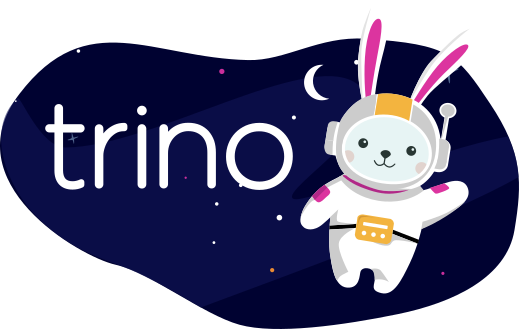

## Trino logos

Here is the following logos. Trino has a cute bunny mascot named Commander Bun Bun.

 <!-- .element width="75%" -->

<!-- .element: style="background-color:#000033aa;" -->

-vertical

## Trino logos usage

* Use a permitted Trino logo to link to Trino.
* Use the icons to denote Trino in architecture diagrams. 
* Use a permitted Trino logo to inform others that you use Trino.
* Use the Trino logo in a slide to discuss and promote awareness to Trino.
* Use the Trino logo in a blog post or news article about Trino.
* Use the permitted Trino logos less prominently than your own company or product name or logo.

<!-- .element: class="r-fit-text" -->

-vertical

## Trino logo dont's

* Do not use the Trino name or any Trino logo in a way that suggests you are or represent the Trino Software Foundation, 
  your offering or project is by the Trino Software Foundation, or that the Trino Software Foundation is endorsing you 
  or your offering or project.
* Do not use any Trino logo as the icon or logo for your business/organization, offering, project, domain name, social 
  media account, chat account, or website.
* Do not modify the permitted Trino logos, including changing the color, dimensions, or combining with other words or 
  design elements.
* Do not use Trino trademarks, logos, or artwork without the Trino Software Foundation’s prior written permission.

<!-- .element: class="r-fit-text" -->

