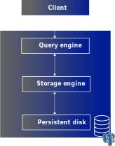
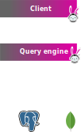
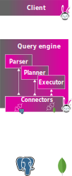
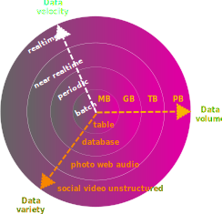
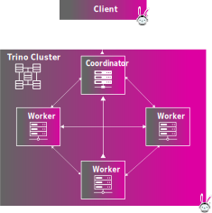
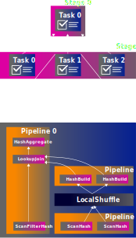

<h3>
  Trino &eacute; um motor de consulta,
    <span class="animate__flipInX" data-delay="500" style="color:#f88600">SQL,</span>
    <span class="animate__flipInX" data-delay="500" style="color:#dd00a1">de c&oacute;digo aberto</span></span>
    <span class="animate__flipInX" data-delay="500" style="color:#f8b600">e absurdamente r&aacute;pido.
    </span>
</h3>

-vertical

## C&oacute;digo Aberto

* Criado e mantido pela comunidade
* Licenciado usando os termos da [Apache license, vers&atilde;o 2.0](https://wikipedia.org/wiki/Apache_License)
* Sem custo para us&aacute;-lo, acessar o c&oacute;digo fonte, redistribuir e modific&aacute;-lo.
* Amig&aacute;vel para uso e ado&ccedil;&atilde;o comercial
* N&atilde;o &eacute; um projeto da [Apache Software Foundation](https://apache.org/)

-vertical

## Structured Query Language (SQL)

* Linguagem declarativa - diga o que, n&atilde;o como
* Utilizar SQL permite que voc&ecirc; delegue a otimiza&ccedil;&atilde;o para o Trino</li>

```sql
SELECT nationkey, count(*) AS count
FROM tpch.tiny.customer
WHERE mktsegment='AUTOMOBILE'
GROUP BY nationkey;
```

-vertical

## Motor de consulta

<div style="float: left; width: 60%; text-align: left; font-size:24px;" class="r-fit-text">
  <ul>
   <li>Trino n&atilde;o &eacute; uma base de dados</li>
    <li>Base de dados inclui motores de consulta SQL</li>
    <li>Base de dados suportam, tamb&eacute;m, componentes de armazenamento, transa&ccedil;&otilde;es e outras capacidades</li>
  </ul>
  <blockquote><p>Qual &eacute; o motivo, ent&atilde;o, para ser apenas um motor de consultas SQL?</p></blockquote>
</div>

<div class="r-stack">
  
  
</div>

-vertical

<h3>
  Trino &eacute; um motor de consultas SQL, absurdamente r&aacute;pido e de c&oacute;digo aberto
  <span class="animate__flipInX">
    desenhado para consultar <span style="color:#dd00a1">fontes de dados diferentes</span>.
  </span>
</h3>

-vertical

## Fontes de dados diferentes

**Arquitetura baseada em conectores** \
\
Um conector &eacute; um interface para o Trino que atua como uma camada de tradu&ccedil;&atilde;o entre
as opera&ccedil;&otilde;es SQL do Trino para linguagens de dom&iacute;nios especificos de v&aacute;rias
fontes de dado heterog&ecirc;neas


<!-- .element style="float: left; width: 60%; text-align: center; font-size: 32px" -->

 <!-- .element width="150vw" style="background-color:#ffffff00" -->

<!-- .element style="float: left;  width: 40%;" -->

-vertical

<h3>
  Trino &eacute; um motor de consulta SQL,
  <span  class="animate__flipInX" data-delay="500">de codigo aberto, </span>
  <span class="animate__flipInX" data-delay="500" style="color:#f88600">distribu&iacute;do, </span>
  <span class="animate__flipInX" data-delay="500" style="color:#dd00a1">de processamento paralelo massivo, </span>
  <span class="animate__flipInX" data-delay="500">absurdamente r&aacute;pido, </span>
  <span class="animate__flipInX" data-delay="500">concebido para consultar</span>
  <span class="animate__flipInX" data-delay="500" style="color:#f8b600">grandes fontes de dados </span>
  <span class="animate__flipInX" data-delay="500"> de uma ou mais fontes de dados diferentes. </span>
</h3>

-vertical

## O que &eacute; uma grande fonte de dados?

<div style="float: left; width: 60%; text-align: left; font-size:36px;" >
  <ul>
    <li>Grande volume de dados depois do boom do Big Data</li>
    <li>De Gigabytes a Petabytes de dados </li>
    <li>Variedade de formatos</li>
    <li>Capacidade de processar dados de minutos at&eacute; nanosegundos</li>
  </ul>
</div>

 <!-- .element width="350vw" style="background-color:#ffffff00" -->

<!-- .element style="float: left;  width: 40%;" -->

O Trino atende a todos esses requisitos al&eacute;m das velocidades interativas.

<!-- .element class="r-fit-text" -->

-vertical

## Sistemas Distribu&iacute;dos

<div style="float: left; width: 60%; text-align: left; font-size:36px;" >
  <ul>
    <li>Processa grande volumes de dados de forma escal&aacute;vel e com custo benef&iacute;cio</li>
    <li>Troca complexidade por resili&ecirc;ncia e escalabilidade</li>
    <li>O n&oacute; <em>coordinator</em> &eacute; respons&aacute;vel por planejar e agendar todas as queries</li>
    <li>A execu&ccedil;&atilde;o da consulta de fato &eacute; feito pelos v&aacute;rios n&oacute;s <em>workers</em></li>
  </ul>
</div>

 <!-- .element width="350vw" style="background-color:#ffffff00" -->

<!-- .element style="float: left;  width: 40%;" -->

-vertical

## Processamento Paralelo Massivo (MPP)


<div style="float: left; width: 60%; text-align: left; font-size:36px;" >
  <ul>
    <li>Distribui o trabalho entre os n&oacute;s de um cluster</li>
    <li>Executa uma <em>long-lived</em> Java Virtual Machine (JVM) em cada n&oacute;</li>
    <li>Grande quantidade de threads paralelas em cada JVM</li>
    <li>Reduz o tempo de execu&ccedil;&atilde;o, mas requer agendamento integrado, gerenciamento de recursos e isolamento</li>
  </ul>
</div>

 <!-- .element width="250vw" style="background-color:#ffffff00" -->

<!-- .element style="float: left;  width: 40%;" -->

-vertical

<h3>
  Trino &eacute; um motor de consulta SQL
  <span style="color:#f88600" class="animate__flipInX" data-delay="500">de c&oacute;digo aberto,</span>
  <span style="color:#dd00a1" class="animate__flipInX" data-delay="500">distribu&iacute;do,</span>
  <span style="color:#f8b600" class="animate__flipInX" data-delay="500">de processamento paralelo massivo,</span>
  <span style="color:#f88600" class="animate__flipInX" data-delay="500">absurdamente rapido</span>
 <!-- <span style="color:#dd00a1" class="animate__flipInX" data-delay="500">query engine</span> -->
  <span class="animate__flipInX" data-delay="500">concebido para consultar</span>
  <span style="color:#f8b600" class="animate__flipInX" data-delay="500">fontes de dados grandes</span>
  <span class="animate__flipInX" data-delay="500">de uma ou mais</span>
  <span style="color:#f88600" class="animate__flipInX" data-delay="500" >fontes de dados distintas.</span>
</h3>
