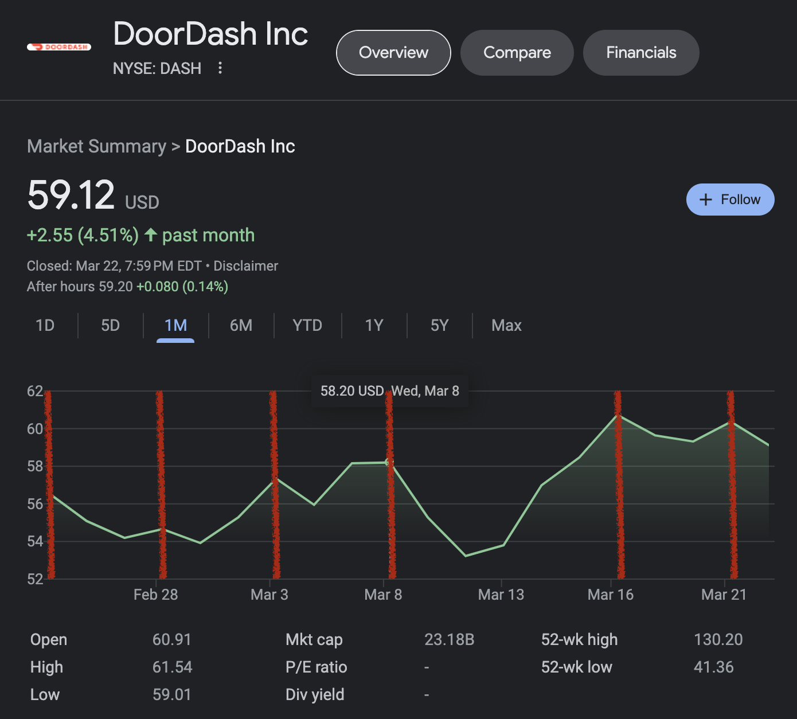

# Pattern recognition

 <!-- .element width="550vw" -->

-vertical

## MATCH_RECOGNIZE

1. `FROM` and `JOIN` <--- (MATCH_RECOGNIZE)
1. `WHERE`
1. `GROUP BY`
1. `HAVING`
1. `SELECT`
1. `DISTINCT`
1. `ORDER BY`
1. `LIMIT`

-vertical

## MATCH_RECOGNIZE

Approach `MATCH_RECOGNIZE` in four steps:

1. Define paritioning and ordering rules <!--helps define the window where the pattern is examined-->
1. Define patterns using regular expressions and variables <!--What pattern am I looking for and how-->
1. Define measure and compute during match <!--What information am I looking to get out of that pattern and what calculations do I do-->
1. Define the shape output <!--How much information do I want back-->

-vertical

## MATCH_RECOGNIZE

1. Define partitions and ordering to identify the window over which your pattern will be evaluated

```sql
PARTITION BY custkey
ORDER BY orderdate
```

-vertical

## MATCH_RECOGNIZE

2. Define the pattern events and the pattern of those events using regular expressions 

```sql
PATTERN (START DOWN+ UP+)
DEFINE
  DOWN AS totalprice < PREV(totalprice),
  UP AS totalprice > PREV(totalprice)
```

This is the classic stock market "V" pattern. 
* `START` matches all columns so we don't skip evaluating the border rows
* `DOWN` matches the pattern where `totalprice` value goes lower from the previous row
* `UP` matches the pattern where `totalprice` value goes higher from the previous row

-vertical

## MATCH_RECOGNIZE

3. Define measures: source data points, pattern data points, and aggregates related to a pattern
```sql
MEASURES
  START.totalprice AS start_price,
  LAST(DOWN.totalprice) AS bottom_price,
  LAST(UP.totalprice) AS final_price,
  START.orderdate AS start_date,
  LAST(UP.orderdate) AS final_date
```
 
-vertical

## MATCH_RECOGNIZE

4. Define output style and specify where the row pattern matching resumes

```sql
ONE ROW PER MATCH
AFTER MATCH SKIP PAST LAST ROW
```
* `ONE ROW PER MATCH` indicates to summarize the results rather than `ALL ROWS PER MATCH`
* `SKIP PAST LAST ROW` indicates where to start checking for matching patterns
  * only used for overlapping patterns

-vertical
## MATCH_RECOGNIZE

### All together now

```sql
SELECT 
  custkey,
  start_price,
  bottom_price,
  final_price,
  start_date,
  bottom_date,
  final_date
FROM orders
  MATCH_RECOGNIZE (
    PARTITION BY custkey
    ORDER BY orderdate
    MEASURES
      START.totalprice AS start_price,
      LAST(DOWN.totalprice) AS bottom_price,
      LAST(UP.totalprice) AS final_price,
      START.orderdate AS start_date,
      LAST(DOWN.orderdate) AS bottom_date,
      LAST(UP.orderdate) AS final_date
    ONE ROW PER MATCH
    PATTERN (START DOWN+ UP+)
    DEFINE
      DOWN AS totalprice < PREV(totalprice),
      UP AS totalprice > PREV(totalprice)
  );
```
