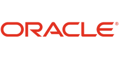

# Concepts

* Recap of what is Trino.
* What is SQL?
* Explain some of the involved components.

-vertical
## Trino

<h3>
  Trino is a ludicrously fast,
      <span style="color:#f88600">open source</span>,
      <span style="color:#dd00a1">distributed</span>,
      <span style="color:#f8b600">massively parallel processing</span>,
      <span style="color:#f88600">SQL</span>
      <span style="color:#dd00a1">query engine</span>.
  designed to query
      <span style="color:#f8b600">large data sets</span> from one or more
  <span style="color:#f88600">disparate data sources</span>.
</h3>

-vertical
## Structured Query Language (SQL)

* Powerful <span style="color:#f88600">declarative</span> programming language
* Data management, manipulation, and <span style="color:#f88600">analytics</span>
* Relational data model
* <span style="color:#f88600">Widespread</span> usage with a large community
* Lots of tooling and expertise available
* Long established history, standardized as <span style="color:#f88600">ISO/ANSI SQL</span>

-vertical
## A quick glance

Show me the name of all nations, sorted alphabetically:

```sql
SELECT name
FROM tpch.tiny.nation
ORDER BY name;
```

But where does the data come from?

-horizontal
## Data source

Any system can be a data source if:

* Data can be presented in tabular format.
* And a Trino connector is available.

> Look at the [list on the Trino
website](https://trino.io/ecosystem/#data-sources).

-vertical
## Data source types

* Object storage systems
* Relational database management systems (RDBMS)
* Document databases and other NoSQL databases
* Key-value stores and streaming systems
* Many others

-vertical
## Object storage

* Files on some storage like HDFS, Amazon S3, Google Cloud Storage, Azure
  storage and others.
* Metadata about the files and data structure within.
<br><br>
<div style="background-color: white">


</div>

-notes
* talk about files and metastore?

-vertical
## RDBMS

Traditional systems you know
<br><br>
<div style="background-color: white">





</div>

-notes
* and more

-vertical
## Many others

<div style="background-color: white">


</div>

-notes
* and more

--horizontal
## Trino and SQL

* SQL support for all data sources
* Same SQL for all data sources
* SQL syntax specific to Trino
* Not the underlying database
* Even if data source does not support SQL

-vertical
## What SQL specifically?

* Close to ISO/ANSI standard
* Adding newer features following new standard versions regularly
* Close to other standards and extensions
* Close to common features and implementations in other systems

If in doubt, check the [documentation](https://trino.io/docs/current/).

-vertical
## Catalog

Configuration to access a data source

* Uses a connector.
* Contains credentials and other access details.
* Adds further specific configuration.
* You can create and use as many catalogs as you want.

> Very important since you access catalogs in Trino.

-vertical
## Connector

* Reads and writes data in a data source.
* Configured in each catalog.
* Translates Trino operations to data source access.
* Establishes tabular concept for data.
* Includes data type mapping and translation.

-vertical
## Not all connectors are equal

Object storage

* Read and write metadata
* Read and write object storage files

RDBMS

* Translate partially to SQL of the RDBMS
* Often use JDBC driver

Others

* Convert to API call or other query languages

-vertical
## Tabular data format

* <span style="color:#f88600">Catalog</span> contains one or more schemas.
* Catalog or schema are equivalent to database.
* Specifics depends on catalog configuration and the data source.
* <span style="color:#f88600">Schema</span> contains one or more tables.
* <span style="color:#f88600">Table</span> contains one or more columns.
* Each <span style="color:#f88600">column</span> has a specific data type.
* Each <span style="color:#f88600">row</span> in a table represents a data set or record.

Think of it like a spreadsheet...

-notes
in fact there is a google sheets connector

-vertical
## Trino cluster

* One URL to connect
* Many servers to process queries
* Many catalogs for many data sources
* Many users
* Many queries

--horizontal
## The result

You can run SQL statements:

```sql
SELECT *
FROM "catalog.schema.table"
WHERE "column" LIKE '%example%'
```

Same SQL with any connected data source.

> Note the `catalog.schema` namespace.

-vertical
## Clients

* Connected to Trino
* Where you write a SQL query
* Run the query
* And receive results

> Clients also orchestrate queries in data pipelines, create reports, and
> produce dashboards.

-vertical
## Client examples

Desktop, web, and other applications

* Trino CLI
* DBeaver, Metabase, and others use the **JDBC driver**
* Apache Superset, dbt, and others use the **Trino Python Client**

[Many clients are supported](https://trino.io/ecosystem/#clients)!

-vertical
## Conclusion

<p>You can write a
<span style="color:#f88600">SQL query</span> in a
<span style="color:#dd00a1"> client</span>, that is connected to a
<span style="color:#f8b600">Trino cluster</span>.</p>

<p>Trino retrieves data from the
<span style="color:#f88600">data sources</span> with the help of
the <span style="color:#f8b600">catalog</span> configuration, and the
<span style="color:#f88600">connector</span> that understands how to access
data in the underlying data source.</p>

-vertical
## Next up

You are ready to [go and learn more](../../index.html#/0/1)


