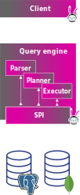

<h3>
  Trino is a ludicrously fast,
  <span class="fragment">
    <span class="animate__flipInX animate__slower">
      <span style="color:#f88600">open source</span>,
    </span> 
    <span class="animate__flipInX animate__slower" data-delay="1000" style="color:#dd00a1">SQL</span>
    <span class="animate__flipInX animate__slower" data-delay="1000">
      <span style="color:#f8b600">query engine</span>.
    </span>
  </span> 
</h3>

-vertical

## Open source

Trino is an *open source* project licensed under the Apache License, version 2.0. Note: this does not make Trino an Apache project.
<!-- .element class="r-fit-text" -->

 <!-- .element width="250vw" style="background-color:#ffffff88" -->

Trino is a community-driven project that believes people make up and own open source communities, not companies.
<!-- .element class="r-fit-text" -->

-vertical

## Structured Query Language (SQL)

* Declaritive Langauge
* De facto standard for accessing data stored in databases

<!-- .element class="r-fit-text" -->

```SQL
SELECT nationkey, COUNT(*) AS count
FROM tpch.tiny.customer
WHERE mktsegment = 'AUTOMOBILE'
GROUP BY nationkey;
```

Trino closely follows the ANSI SQL standard around OLAP-related features, but more recently 
new additions support more SQL features that enable write functionality expected in
databases and data warehouses.

<!-- .element class="r-fit-text" -->

-vertical

## Query Engine

 - Trino is not a database
 - Databases include query engines, but also support all the components around storage, transactions, and other feautres.

 <!-- .element width="150vw" style="background-color:#ffffff00" -->
&emsp; &emsp;
 <!-- .element width="150vw" style="background-color:#ffffff00" -->

What’s the point of just a query engine? 

-vertical
 
<h3>
  Trino is a ludicrously fast, open source, SQL query engine...
  <span class="fragment">
    <span class="animate__flipInX animate__slower">
      designed to query <span style="color:#dd00a1">disparate data sources</span>.
    </span>
  </span>
</h3>

-vertical

## Disparate data sources

 <!-- .element width="150vw" style="background-color:#ffffff00" -->

 _SPI (Service Provider Interface)_ is a translator from the SQL operations to the domain-specific language of various heterogeneous data sources.

-vertical

<h3>
  Trino is a ludicrously fast, open source, 
  <span class="fragment">
    <span class="animate__flipInX animate__slower">
      <span style="color:#f88600">distributed</span>,
    </span>
    <span class="animate__flipInX animate__slower">
      <span style="color:#dd00a1">massively parallel processing</span>,
    </span>
  </span>
  SQL query engine designed to query 
  <span class="fragment">
    <span class="animate__flipInX animate__slower">
      <span style="color:#f8b600">large data sets</span> from one or more
    </span>
  </span>
  disparate data sources.
</h3>

-vertical

## What is a large data set?

 <!-- .element width="350vw" style="background-color:#ffffff00" -->

* Relative to the scale after the initial boom of Big Data
* Gigabytes to petabytes of data 
* A variety of data formats
* Able to be processed in minutes to nanoseconds

Trino keeps up with all these requirements on top of the interactive speeds.

-vertical

## Distributed systems

 <!-- .element width="350vw" style="background-color:#ffffff00" -->

* Processes big data in a scalable and cost-efficient manner
* Trades off complexity for resiliency and scalability
* The coordinator node is responsible for planning and scheduling all the queries
* Query execution is distributed across multiple Trino worker nodes

-vertical

## Massively parallel processing (MPP) architecture

 <!-- .element width="350vw" style="background-color:#ffffff00" -->

* Splits work up across nodes and threads. 
* Shares a single long-lived Java Virtual Machine (JVM) process on worker nodes.
* Reduces response time, but requires integrated scheduling, resource management, and isolation.

-vertical

<h3>
  Trino is a ludicrously fast, 
      <span style="color:#f88600">open source</span>,
      <span style="color:#dd00a1">distributed</span>,
      <span style="color:#f8b600">massively parallel processing</span>,
      <span style="color:#f88600">SQL</span>
      <span style="color:#dd00a1">query engine</span>.
  designed to query 
      <span style="color:#f8b600">large data sets</span> from one or more
  <span style="color:#f88600">disparate data sources</span>.
</h3>
