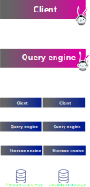
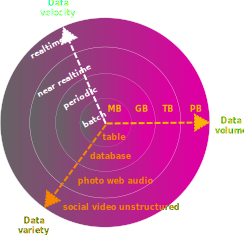

<h3>
  Trino is a ludicrously fast,
  
    
      open source,
     
    SQL
    
      query engine.
    
   
</h3>

-vertical

## Open source

  <ul>
    <li>Trino is an <b>open source</b> project licensed under the Apache License, version 2.0</li>
    <li><b>Note:</b> This does not make Trino an Apache project</li>
    <li>Trino is free to run, view the source, redistribute, and modify in any way you see fit</li>
  </ul>

 <!-- .element height="220" style="background-color:#ffffff75" -->

<!-- .element style="float: left; width: 40%;" -->

-vertical

## Structured Query Language (SQL)

  <ul>
    <li>Declarative language - specify what, not how</li>
    <li>Using SQL enables Trino to do the heavy lift of optimizing the code so you don't have to</li>
  </ul>

 <!-- .element height="220" style="background-color:#ffffff75" -->

<!-- .element style="float: left; width: 40%;" -->

-vertical

## Query Engine

  <ul>
    <li>Trino is not a database</li>
    <li>Databases include query engines, but also support all the components around storage, transactions, and other features</li>
  </ul>

  
  

<!-- .element style="float: left;  width: 40%;" -->

What&#39;s the point of just a query engine? 

-vertical
 
<h3>
  Trino is a ludicrously fast, open source, SQL query engine...
  
    
      designed to query disparate data sources.
    
  
</h3>

-vertical

## Disparate data sources

**SPI (Service Provider Interface)** \
\
A translation layer from the SQL operations to the domain-specific language of various heterogeneous data sources.

<!-- .element style="float: left; width: 60%; text-align: center; font-size: 32px" -->

 <!-- .element width="150vw" style="background-color:#ffffff00" -->

<!-- .element style="float: left;  width: 40%;" -->

-vertical

<h3>
  Trino is a ludicrously fast, open source, 
  
    
      distributed,
    
    
      massively parallel processing,
    
  
  SQL query engine designed to query 
  
    
      large data sets from one or more
    
  
  disparate data sources.
</h3>

-vertical

## What is a large data set?

  <ul>
    <li>Relative to the scale after the initial boom of Big Data</li>
    <li>Gigabytes to petabytes of data</li>
    <li>A variety of data formats</li>
    <li>Able to be processed in minutes to nanoseconds</li>
  </ul>

 <!-- .element width="350vw" style="background-color:#ffffff00" -->

<!-- .element style="float: left;  width: 40%;" -->

Trino keeps up with all these requirements on top of the interactive speeds.

<!-- .element class="r-fit-text" -->

-vertical

## Distributed systems

  <ul>
    <li>Processes big data in a scalable and cost-efficient manner</li>
    <li>Trades off complexity for resiliency and scalability</li>
    <li>The coordinator node is responsible for planning and scheduling all the queries</li>
    <li>Query execution is distributed across multiple Trino worker nodes</li>
  </ul>

 <!-- .element width="350vw" style="background-color:#ffffff00" -->

<!-- .element style="float: left;  width: 40%;" -->

-vertical

## Massively parallel processing (MPP) architecture

  <ul>
    <li>Splits work up across nodes and threads</li>
    <li>Shares a single long-lived Java Virtual Machine (JVM) process on worker nodes</li>
    <li>Reduces response time, but requires integrated scheduling, resource management, and isolation</li>
  </ul>

 <!-- .element width="250vw" style="background-color:#ffffff00" -->

<!-- .element style="float: left;  width: 40%;" -->

-vertical

<h3>
  Trino is a ludicrously fast, 
      open source,
      distributed,
      massively parallel processing,
      SQL
      query engine.
  designed to query 
      large data sets from one or more
  disparate data sources.
</h3>
